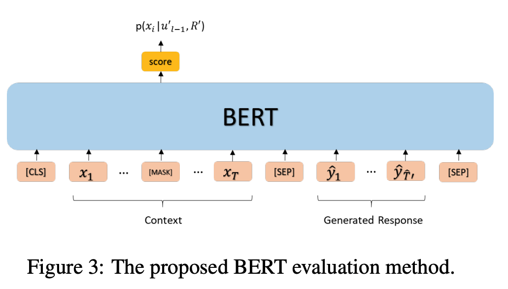

## bert-evaluation

Ghazarian et al. (2019) show that BERT can be used to evaluate the generated response. We employ BERT-based evaluation metrics to evaluate whether the generated response is knowledgeable as supplements to PPL and F1. As shown in Table 3, the dialogue generation model is first required to generate response $\hat{R}$ based on the dialogue context $U = {u_1, . . . , u_{l−1}}$. We use the special token [MASK] to replace the topic word in the last context utterance $u_{l−1}$. Then a masked language model (i.e. BERT-large) is used to predict the masked topic word using the last context utterance $u_{l−1}$ and the generated response $\hat{R}$. The recall@k for the masked language model is used to measure the knowledge stored in the dialogue generation model. Intuitively, if a ==dialogue generation model is more knowledgeable, the masked language model is stronger to predict the masked topic word based on the generated response $\hat{R}$  and last context utterance $u_{l−1}$==

